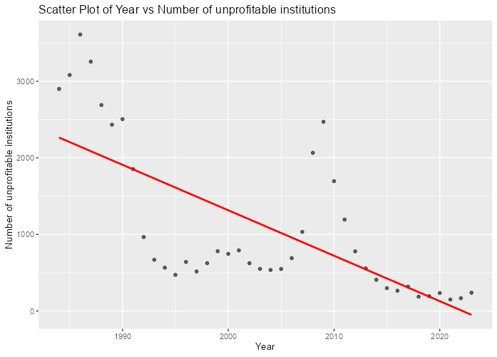
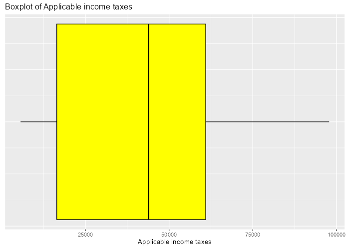
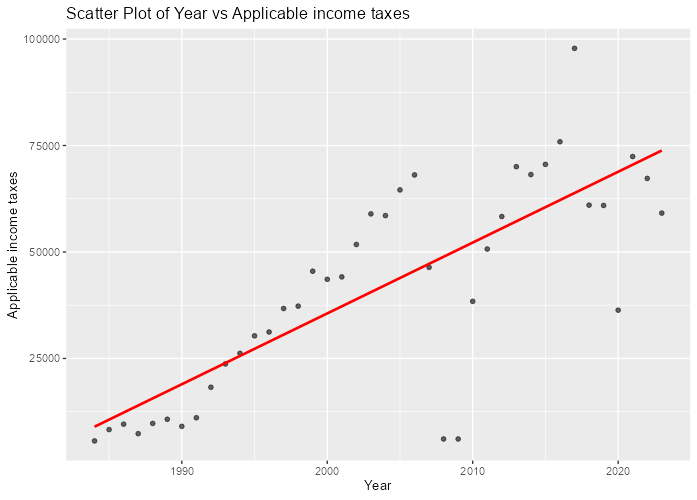

## Introduction


The 2008 financial crisis had lasting and far-reaching effects. One of the primary institutions that reflected the severity of this crisis was the banking industry. Given that banks support nearly every other industry in the US, it is vital to understand the impact of the financial crisis on banks to understand how other industries were impacted. Our group decided to investigate key financial statistics from the Federal Deposit Insurance Corporation (FDIC) to learn more about the impacts of the 2008 financial crisis.

## Exploratory data analysis


After loading and cleaning an all encompassing FDIC annual report, we created a shiny app that displayed correlations and distributions of selected variables. These graphs allowed us to observe the variables that were highly variable in the years of the financial crisis, 2008 and 2009. There were several variables that appeared to be impacted by the financial crisis.

The first variable we noticed a difference in 2008 and 2009 was that the number of unprofitable institutions increased dramatically in 2008 and 2009.

```{r, include=F}
library(tidyverse)
library(jtools)
df <- read_csv("annual-income_update.csv")
```

```{r}
summary(df$`Number of unprofitable institutions`)
```

Generally, this variable is skewed right. The earliest data in our dataset started in 1980, when this value was generally higher than the trend in the 2000s. There are not any outliers in this variable. When we plotted the number of unprofitable banks by year, we could see a deviation from the trend of the time period in 2008 and 2009. This makes sense with the financial crisis, because part of what caused this crisis was banks struggling to afford their costs. This would make a bank unprofitable.

{width=75%}

Another variable we investigated is applicable income tax. The variable is generally uniform with no outliers.

{width=75%}

This variable may reflect some of the bank's profits, because that is generally what is taxed by the US Government. Again, with applicable income tax, we observe a similar pattern of the value reaching about 1980s levels in 2008 and 2009.

{width=75%}

This lack of tax revenue from banks likely means that the US government had to raise funds or borrow more money in order to pay bills in 2008 and 2009. This could have impacted the federal debt and global financial markets.

## Statistical Question

Is there a statistically significant relationship between year and the number of unprofitable institutions reported by the FDIC?

#### Hypothesis:  


H~0~: $\beta$ = 0

H~a~: $\beta$ $\not=$ 0

#### Testing

{width=75%}

MODEL INFO: Observations: 40 Dependent Variable: Number of unprofitable institutions Type: OLS linear regression

MODEL FIT: F(1,38) = 34.962, p = 0.000 R² = 0.479 Adj. R² = 0.465

Standard errors: OLS

|             |       Est. |      S.E. | t val. |     p |
|-------------|-----------:|----------:|-------:|------:|
| (Intercept) | 120051.373 | 20116.281 |  5.968 | 0.000 |
| Year        |    -59.368 |    10.040 | -5.913 | 0.000 |

#### Interpretation

At $\alpha$ = 0.05, we reject the null hypothesis. There is statistically significant evidence that the relationship between year and the number of unprofitable institutions reported to the FDIC is not zero.

The negative coefficient on the year variable indicates that the number of unprofitable institutions has decreased over time. When looking at the scatter plot of year and the number of unprofitable institutions, it is clear that 2008 and 2009 are abnormal points. This indicates that the regression line may be affected by these outliers.

```{r, include=FALSE}
df <- read_csv("annual-income_update.csv")
```

```{r, include=TRUE, out.width="50%"}
df <- df |> 
  filter(Year != c(2008, 2009))
```

```{r, include=TRUE, out.width="75%"}
ggplot(df, aes(Year, `Number of unprofitable institutions`)) +
  geom_point(alpha = 0.6) +
  geom_smooth(method = "lm", color = "red", se = FALSE) +
  labs(
    title = "Number of unprofitable institutions over time without 2008 and 2009"
  )
```

```{r, include=FALSE}
model = lm(`Number of unprofitable institutions`~Year, data=df)
print(summ(model))
```

MODEL INFO: Observations: 38 Dependent Variable: Number of unprofitable institutions Type: OLS linear regression

MODEL FIT: F(1,36) = 46.72, p = 0.00 R² = 0.56 Adj. R² = 0.55

Standard errors: OLS

|             |      Est. |     S.E. | t val. |    p |
|-------------|----------:|---------:|-------:|-----:|
| (Intercept) | 125887.42 | 18264.64 |   6.89 | 0.00 |
| Year        |    -62.32 |     9.12 |  -6.84 | 0.00 |

As would be expected, when 2008 and 2009 are eliminated from the dataset, the slope on the Year coefficient decreases. This means that 2008 and 2009 are slightly increasing the slope of the regression line because of their exceptionally high values.

## Conclusion

In conclusion, the 2008 financial crisis had far reaching impacts on banks. Many important variables reported to the FDIC have abnormal values for these years. Notably, the amount of income tax collected by the federal government dropped sharply in 2008 and 2009, which may have reduced the resources available to respond to the financial crisis. Further, though the number of unprofitable institutions have decreased significantly since the 1980s, the value jumped back up to 1980s levels in 2008 and 2009. Understanding the impact of the 2008 financial crisis on banks may help us understand some of the secondary effects of the crisis.
